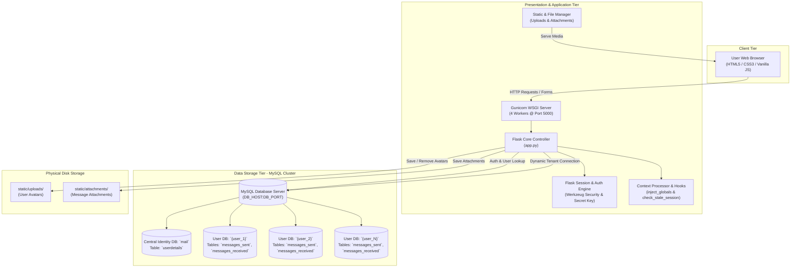
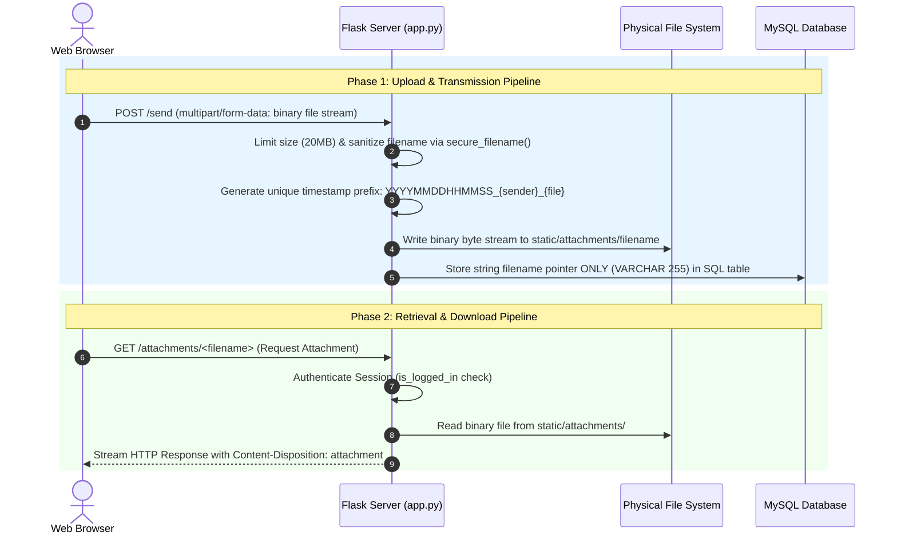
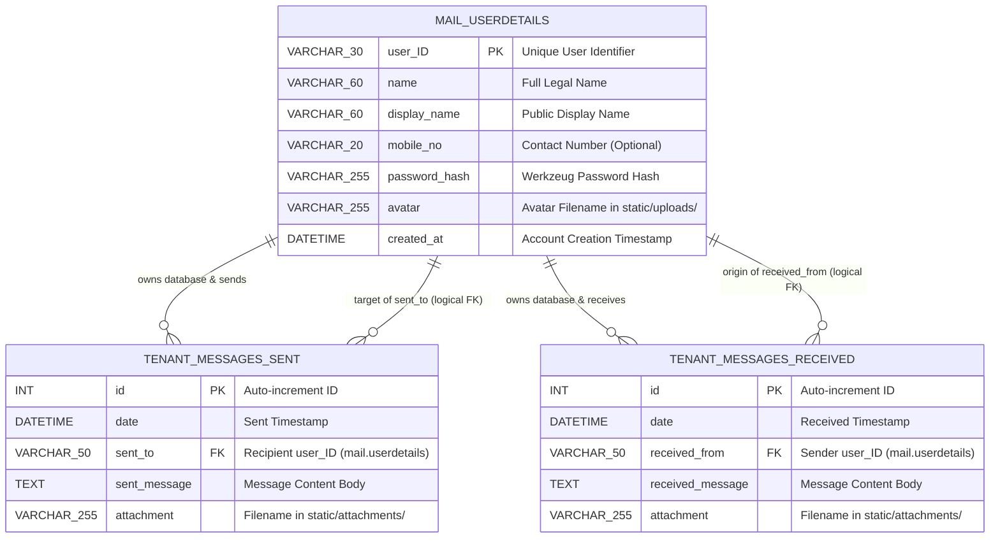
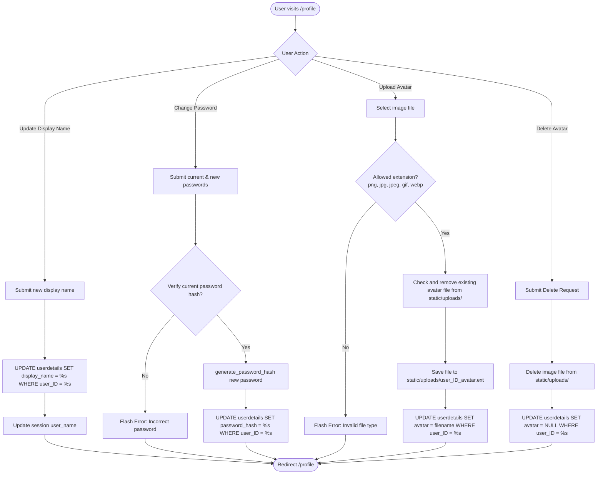
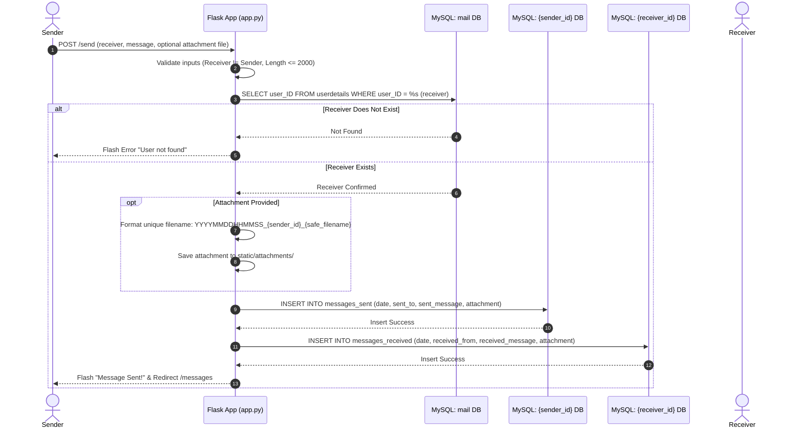
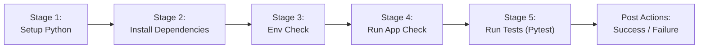

# Comprehensive Technical Project Report: MiniMail (MySQL Architecture)

---

## 1. Executive Summary

**MiniMail** (also referred to as *Cipher Mail*) is a high-performance, private, web-based messaging platform designed to facilitate secure communication and media attachment sharing between users. 

Built on a **Multi-Tenant MySQL Database Isolation Architecture**, MiniMail decouples central user authentication and profile metadata from messaging data stores. Each registered user receives a dedicated, isolated MySQL database instance (`{user_ID}`) containing their outgoing (`messages_sent`) and incoming (`messages_received`) message tables. Central authentication, credentials, and user profiles reside in a primary system database (`mail`).

The application features a sleek dark-themed frontend, salt-and-hash password security using Werkzeug, real-time AJAX receiver verification, customizable user avatars, timestamped attachment storage, containerized deployment via Docker Compose (Gunicorn WSGI + MySQL 8.0), and automated continuous integration via a 5-stage Jenkins pipeline.

> [!NOTE]
> This documentation serves as the complete technical blueprint and onboarding guide for developers, system architects, and DevOps engineers operating the MiniMail platform.

---

## 2. High-Level Architecture & Component Breakdown

### 2.1. Architecture Diagram



### 2.2. Detailed Component Analysis

#### 1. Presentation & Client Tier
- **Templates (Jinja2)**: 8 responsive HTML templates (`base.html`, `home.html`, `signup.html`, `login.html`, `dashboard.html`, `messages.html`, `send_message.html`, `profile.html`) utilizing semantic HTML5.
- **Custom Design System (`style.css`)**: Vanilla CSS styling featuring custom CSS variables, flexbox/grid layouts, card elevations, smooth transitions, and responsive breakpoints.
- **Micro-Interactions & AJAX Engine (`main.js`)**: Handles tab switching on inbox/sent views, modal management, character countdowns on compose inputs, auto-dismissing flash alerts, and live AJAX receiver lookup against `/api/user/<uid>`.

#### 2. Flask Application Tier (`app.py`)
- **Core Controller**: Manages request routing, session validation, flash message queuing, and file upload validation.
- **Session & Security Manager**: Employs Werkzeug's `generate_password_hash` and `check_password_hash` algorithms. Sessions are cryptographically signed using `SECRET_KEY`.
- **Global Hooks**:
  - `@app.before_request check_stale_session()`: Invalidates active sessions if user credentials no longer match the database.
  - `@app.context_processor inject_globals()`: Automatically injects current user profile data across all rendered templates.

#### 3. Data Storage Tier (MySQL Multi-Tenant Architecture)
- **Central Identity Database (`mail`)**: Contains the `userdetails` table storing registered accounts, display names, phone numbers, hashed passwords, avatar filenames, and account creation dates.
- **Per-User Isolated Databases (`{user_ID}`)**: Provisioned dynamically during registration. Contains `messages_sent` and `messages_received` tables tailored specifically to each individual user.
- **Connection Helper (`connect_db(db_name="mail")`)**: Opens connections to the target database instance on the MySQL server using parameterized queries (`%s`).

#### 4. File Management & Media Subsystem
- **Avatar Storage (`static/uploads/`)**: Stores sanitized user profile images named `{user_ID}_avatar.{ext}`.
- **Attachment Storage (`static/attachments/`)**: Stores timestamp-prefixed files sent in messages formatted as `YYYYMMDDHHMMSS_{sender_id}_{filename}`.

### 2.3. Static Media Transmission & File Storage Architecture



#### Detailed Transmission Mechanics:

1. **Client-to-Server Ingestion (`multipart/form-data`)**:
   - Files are **never binary-encoded directly into SQL queries** (avoiding BLOB database bloat).
   - Forms submit files using HTML `enctype="multipart/form-data"`. The browser splits the payload into MIME parts containing metadata headers and raw binary data streams sent over HTTP POST.
   - Flask intercepts this via Werkzeug's request parser, making file stream instances accessible in `request.files`.

2. **Validation, Naming & Disk Storage**:
   - **File Size Cap**: Requests exceeding 20MB are rejected by Flask's `MAX_CONTENT_LENGTH`.
   - **Filename Sanitization**: `secure_filename()` strips dangerous characters, path traversal relative symbols (`../`, `/`, `\`), preventing Arbitrary File Write attacks.
   - **Unique Prefix Assignment**: Attachments are prepended with `YYYYMMDDHHMMSS_{sender_id}_` to avoid filename collisions on disk.
   - **Disk Allocation**: Files are written directly to physical server paths (`static/uploads/` for avatars, `static/attachments/` for message files).

3. **Database String Pointer Storage**:
   - Rather than storing large binary objects in MySQL, tables store **only a 255-character string filename pointer** (e.g., `attachment = '20260811172600_john_document.pdf'`).
   - This keeps SQL row size small, speeds up database query performance, and allows independent scaling of file storage.

4. **Server-to-Client Download & Streaming**:
   - **Avatars**: Served statically via Flask's built-in static asset handler at `/static/uploads/<filename>` for `` rendering.
   - **Message Attachments**: Downloaded via a protected endpoint `@app.route('/attachments/<filename>')`:
     - **Session Protection**: Validates active login via `is_logged_in()`.
     - **Binary Streaming**: Calls `send_from_directory(app.config["ATTACH_FOLDER"], filename, as_attachment=True)`.
     - **Header Mechanics**: Setting `as_attachment=True` injects the HTTP header `Content-Disposition: attachment; filename="..."`, causing the browser to prompt a file save dialog rather than rendering binary content directly.

5. **Docker Volume Persistence**:
   - In containerized production, local directories (`./static/uploads` and `./static/attachments`) are mounted as **Docker volumes** (`- ./static/uploads:/app/static/uploads`), ensuring files persist safely across container restarts and rebuilds.

---

## 3. Entity-Relationship (ER) Diagram & Schema Specifications

### 3.1. Entity-Relationship Diagram



### 3.2. Data Dictionary

#### Central Database: `mail`

##### Table: `userdetails`
| Column Name | Data Type | Constraints | Description |
|---|---|---|---|
| `user_ID` | `VARCHAR(30)` | **PRIMARY KEY**, NOT NULL | Unique handle chosen during registration |
| `name` | `VARCHAR(60)` | NOT NULL | User's full name |
| `display_name` | `VARCHAR(60)` | DEFAULT NULL | Customizable public display name |
| `mobile_no` | `VARCHAR(20)` | DEFAULT NULL | Optional contact mobile number |
| `password_hash` | `VARCHAR(255)` | NOT NULL | Hashed representation of user password |
| `avatar` | `VARCHAR(255)` | DEFAULT NULL | Relative path/filename of uploaded profile image |
| `created_at` | `DATETIME` | DEFAULT CURRENT_TIMESTAMP | System timestamp of registration |

---

#### Tenant Database: `{user_ID}` (Dynamic Database per User)

##### Table: `messages_sent`
| Column Name | Data Type | Constraints | Description |
|---|---|---|---|
| `id` | `INTEGER` | **PRIMARY KEY AUTO_INCREMENT** | Unique message ID within sender's database |
| `date` | `DATETIME` | NOT NULL | Timestamp when message was dispatched |
| `sent_to` | `VARCHAR(50)` | NOT NULL (*Logical FK*) | Recipient's `user_ID` in `mail.userdetails` |
| `sent_message` | `TEXT` | DEFAULT NULL | Body text of sent message (up to 2000 chars) |
| `attachment` | `VARCHAR(255)` | DEFAULT NULL | Filename stored in `static/attachments/` |

##### Table: `messages_received`
| Column Name | Data Type | Constraints | Description |
|---|---|---|---|
| `id` | `INTEGER` | **PRIMARY KEY AUTO_INCREMENT** | Unique message ID within recipient's database |
| `date` | `DATETIME` | NOT NULL | Timestamp when message was delivered |
| `received_from` | `VARCHAR(50)` | NOT NULL (*Logical FK*) | Sender's `user_ID` in `mail.userdetails` |
| `received_message` | `TEXT` | DEFAULT NULL | Body text of received message |
| `attachment` | `VARCHAR(255)` | DEFAULT NULL | Filename stored in `static/attachments/` |

---

## 4. Tech Stack Analysis: Advantages, Disadvantages & Alternatives

| Component | Selected Technology | Advantages | Disadvantages | Modern Alternatives |
|---|---|---|---|---|
| **Backend Framework** | **Flask (Python 3.10)** | Ultra-lightweight, fast execution, explicit routing control, zero boilerplate overhead. | Lacks built-in ORM or admin tools out of the box; requires manual database query management. | **Django** (Full-stack ORM & admin), **FastAPI** (Asynchronous I/O & automatic OpenAPI generation), **Express.js** (Node.js ecosystem). |
| **Database Engine** | **MySQL 8.0** | Robust transactional integrity (ACID), widespread production support, native multi-database hosting, high throughput for relational reads/writes. | Requires continuous server process memory overhead and host configuration compared to embedded databases. | **PostgreSQL** (Advanced relational & JSON support), **SQLite** (Embedded zero-config single file), **MongoDB** (NoSQL document store). |
| **Database Driver** | **`mysql-connector-python`** | Direct native MySQL protocol communication, raw query execution, no abstraction overhead. | Requires writing raw SQL statements with explicit `%s` parameterization. | **SQLAlchemy** (Full Python ORM), **PyMySQL** (Pure-Python MySQL driver), **Peewee**. |
| **Authentication & Hashing** | **Werkzeug Security** | Secure password salting/hashing out of the box (`generate_password_hash` / `check_password_hash`), protection against rainbow tables. | Hashing parameters bound to standard PBKDF2/SHA256 configurations. | **Bcrypt**, **Argon2id** (Memory-hard password hashing standard), **OAuth2 / OIDC** (Third-party identity management). |
| **WSGI / Web Server** | **Gunicorn** | Multi-process worker model (`gunicorn -w 4`), handles concurrent HTTP requests efficiently in production environments. | Linux-native daemon model; requires proxy integration for SSL termination. | **uWSGI**, **Waitress** (Windows WSGI host), **Hypercorn** (ASGI/HTTP/2 server). |
| **Containerization** | **Docker & Docker Compose** | Reproducible deployment environments across dev/staging/prod; multi-container orchestration (`web` + `db`). | Image size overhead (~150MB-300MB per container). | **Podman**, **Kubernetes** (Large-scale cluster orchestration), **AWS ECS**. |
| **CI/CD Pipeline** | **Jenkins** | Highly customizable open-source automation server; declarative Jenkinsfile pipeline supporting test automation and build stages. | Requires self-hosted infrastructure management. | **GitHub Actions** (SaaS cloud runners), **GitLab CI/CD**, **CircleCI**. |
| **Testing Framework** | **Pytest + Pytest-Cov** | Clean fixture syntax, comprehensive coverage analysis (`--cov=app`), fast assertion evaluation. | Requires test environment configuration for isolated test DB executions. | **Unittest** (Built-in standard library), **Nose2**. |

---

## 5. End-to-End Technical Workflows & Core Logic

### 5.1. User Registration & Database Provisioning Workflow

```mermaid
sequenceDiagram
    autonumber
    actor User
    participant App as Flask Application (app.py)
    participant Auth as Session & Werkzeug Auth
    participant CentralDB as MySQL: mail DB
    participant UserDB as MySQL: {user_ID} DB

    User->>App: POST /signup (name, phone, user_id, password, confirm_password)
    App->>App: Validate required fields, ID syntax & password length (>=6)
    App->>CentralDB: SELECT user_ID FROM userdetails WHERE user_ID = %s
    alt User ID Already Exists
        CentralDB-->>App: User Record Found
        App-->>User: Flash Error "User ID taken" & Redirect /signup
    else User ID Available
        CentralDB-->>App: No Record Found
        App->>App: Hash Password using generate_password_hash(password)
        App->>CentralDB: INSERT INTO userdetails (user_ID, name, display_name, mobile_no, password_hash)
        CentralDB-->>App: Insert Success
        App->>UserDB: CREATE DATABASE `{user_ID}`
        App->>UserDB: CREATE TABLE messages_sent (...)
        App->>UserDB: CREATE TABLE messages_received (...)
        UserDB-->>App: Provisioning Complete
        App->>Auth: session['user_id'] = user_id; session['user_name'] = name
        App-->>User: Flash Success & Redirect /dashboard
    end
```

---

### 5.2. Profile Management & Media Storage Workflow



---

### 5.3. Dual-Write Messaging & File Attachment Workflow



---

### 5.4. Two-Way Synchronized Message Deletion Workflow

```mermaid
flowchart TD
    Start([User clicks Delete Message on /messages]) --> CheckType{Box Type?}
    
    CheckType -->|Received Box| DelRec[DELETE FROM messages_received WHERE id = %s in user's DB]
    DelRec --> Done([Flash "Message Deleted" & Redirect])

    CheckType -->|Sent Box| FetchSent[SELECT date, sent_to, sent_message FROM messages_sent WHERE id = %s]
    FetchSent --> DeleteSender[DELETE FROM messages_sent WHERE id = %s in sender DB]
    DeleteSender --> CascadeReceiver[DELETE FROM messages_received WHERE date=%s AND received_from=%s AND received_message=%s in receiver DB]
    CascadeReceiver --> Done
```

---

### 5.5. Account Termination & Cleanup Workflow

```mermaid
flowchart TD
    Start([User submits /delete_account with password]) --> FetchUser[Fetch userdetails row from mail DB]
    FetchUser --> CheckPW{check_password_hash valid?}
    CheckPW -->|No| Error([Flash "Incorrect password" & Redirect /profile])
    CheckPW -->|Yes| ExecDelete[DELETE FROM userdetails WHERE user_ID = %s in mail DB]
    ExecDelete --> DropTenantDB[DROP DATABASE IF EXISTS `{user_ID}`]
    DropTenantDB --> CleanSession[session.clear]
    CleanSession --> Complete([Flash "Account permanently deleted" & Redirect /home])
```

---

## 6. Containerization Architecture & Production Deployment

### 6.1. Docker Container Design (`Dockerfile`)

The application is packaged as a lightweight, containerized image based on Python 3.10 slim:

```dockerfile
FROM python:3.10-slim

WORKDIR /app

# Install system dependencies
RUN apt-get update && \
    apt-get install -y pkg-config && \
    rm -rf /var/lib/apt/lists/*

COPY requirements.txt .
RUN pip install --no-cache-dir -r requirements.txt

COPY . .

# Ensure upload directories exist
RUN mkdir -p static/uploads static/attachments

EXPOSE 5000

# Run with Gunicorn in production
CMD ["gunicorn", "-w", "4", "-b", "0.0.0.0:5000", "app:app"]
```

#### Key Container Engineering Principles:
1. **Minimal Base Image**: Uses `python:3.10-slim` to reduce container vulnerability footprint and keep image size small.
2. **Layer Caching**: Copies `requirements.txt` independently to cache Python dependency layers.
3. **Volume Pre-allocation**: Explicitly creates `static/uploads` and `static/attachments` directory structures.
4. **WSGI Production Server**: Executes Gunicorn with 4 worker processes (`-w 4`), binding to port 5000.

---

### 6.2. Multi-Container Orchestration (`docker-compose.yml`)

```yaml
version: '3.8'

services:
  web:
    build: .
    ports:
      - "5000:5000"
    environment:
      - DB_HOST=db
      - DB_USER=root
      - DB_PASSWORD=${DB_PASSWORD}
      - SECRET_KEY=${SECRET_KEY}
      - FLASK_DEBUG=False
    volumes:
      - ./static/uploads:/app/static/uploads
      - ./static/attachments:/app/static/attachments
    depends_on:
      - db
    restart: unless-stopped

  db:
    image: mysql:8.0
    command: --default-authentication-plugin=mysql_native_password
    environment:
      - MYSQL_ROOT_PASSWORD=${DB_PASSWORD}
      - MYSQL_DATABASE=mail
    volumes:
      - mysql_data:/var/lib/mysql
    ports:
      - "3306:3306"
    restart: unless-stopped

volumes:
  mysql_data:
```

---

## 7. CI/CD Pipeline Architecture (`Jenkinsfile`)

MiniMail incorporates a 5-stage declarative Jenkins pipeline for continuous integration and automated testing:



### Stage Breakdown:
1. **Setup Python**: Verifies Python and Pip versions installed on the Jenkins build agent.
2. **Install Dependencies**: Executes `pip install -r requirements.txt` to configure build dependencies.
3. **Env Check**: Validates database and secret key environment parameters (`DB_HOST`, `DB_USER`, etc.).
4. **Run App Check**: Performs syntax and bytecode compilation verification via `python -m py_compile app.py`.
5. **Run Tests**: Executes the full unit test suite with coverage evaluation using `pytest --cov=app --cov-report=term-missing`.
6. **Post Execution**: Generates pipeline execution logs upon success or failure.

---

## 8. Complete Repository Directory & File Responsibility Matrix

| Path / Filename | Type | Primary Purpose & Responsibilities |
|---|---|---|
| `app.py` | Python Script | Main Flask web application core, handling database connections, user authentication, profile updates, dual-write messaging, AJAX API routes, and session handlers. |
| `requirements.txt` | Dependency File | Package dependencies listing Flask, Werkzeug, Pytest, Pytest-Cov, Python-Dotenv, and Gunicorn. |
| `Dockerfile` | Container Spec | Docker container build instructions targeting Python 3.10-slim and Gunicorn WSGI. |
| `docker-compose.yml` | Deployment Orchestration | Multi-container specification for running Flask (`web`) alongside a dedicated MySQL 8.0 service (`db`). |
| `Jenkinsfile` | CI/CD Pipeline | Declarative Jenkins CI pipeline configuring 5 test & build validation stages. |
| `migrate.py` | Python Script | Code transformation utility script for refactoring database function calls. |
| `cols.txt` | Metadata File | Reference list of column mappings used in user details queries. |
| `.env` | Config File | Local environment variable definitions for secret key and database credentials (`DB_HOST`, `DB_USER`, `DB_PASSWORD`, `SECRET_KEY`). |
| `.gitignore` | Version Control | Prevents tracking of virtual environments (`venv/`), Python bytecodes (`__pycache__/`), database files, and uploaded media. |
| `README.md` | Documentation | Project overview, quickstart instructions, and manual setup guides. |
| `templates/base.html` | Jinja2 Template | Master layout wrapper establishing navigation sidebar, header, flash alerts, modal definitions, and footer structure. |
| `templates/home.html` | Jinja2 Template | Public landing page displaying marketing hero section, feature breakdown, and quick login/signup CTA buttons. |
| `templates/signup.html` | Jinja2 Template | Registration form template for collecting name, mobile number, user ID, and password credentials. |
| `templates/login.html` | Jinja2 Template | User authentication template with user ID and password input controls. |
| `templates/dashboard.html` | Jinja2 Template | Authenticated user overview panel showing total messages count, recent inbox previews, and shortcut action cards. |
| `templates/messages.html` | Jinja2 Template | Tabbed view displaying received messages inbox, sent messages outbox, full message viewer modal, and deletion controls. |
| `templates/send_message.html` | Jinja2 Template | Message composition interface featuring real-time AJAX receiver verification, 2000-character input counter, and attachment upload controls. |
| `templates/profile.html` | Jinja2 Template | User profile management hub supporting display name modification, password updates, avatar uploads/removals, and account deletion confirmation. |
| `static/style.css` | CSS Stylesheet | Centralized custom design system defining color palettes, dark theme styling, elevated card containers, form controls, and responsive grid layouts. |
| `static/main.js` | JavaScript File | Client-side scripting module managing tab switching, modal open/close events, character counter updates, live receiver AJAX lookups (`/api/user/<uid>`), and flash notification dismissal. |
| `tests/conftest.py` | Pytest Fixture | Test configuration module establishing test clients and mock session contexts. |
| `tests/test_auth.py` | Test Suite | Unit tests validating signup, login, password hashing, and logout handlers. |
| `tests/test_messages.py` | Test Suite | Unit tests verifying message sending, receiver validation, and inbox/outbox queries. |
| `tests/test_db_logic.py` | Test Suite | Unit tests verifying connection creation, SQL initialization, and multi-tenant database operations. |
| `tests/test_advanced.py` | Test Suite | Integration tests evaluating profile updates, avatar file validation, and message deletion synchronization. |
| `tests/test_full_coverage.py` | Test Suite | Additional coverage edge-case tests verifying invalid inputs, long messages, and error handling. |
| `tests/test_final_coverage.py` | Test Suite | Comprehensive coverage boosting tests targeting 90%+ line coverage. |
| `tests/test_90_boost.py` | Test Suite | Edge case validation for boundary conditions and before-request hooks. |
